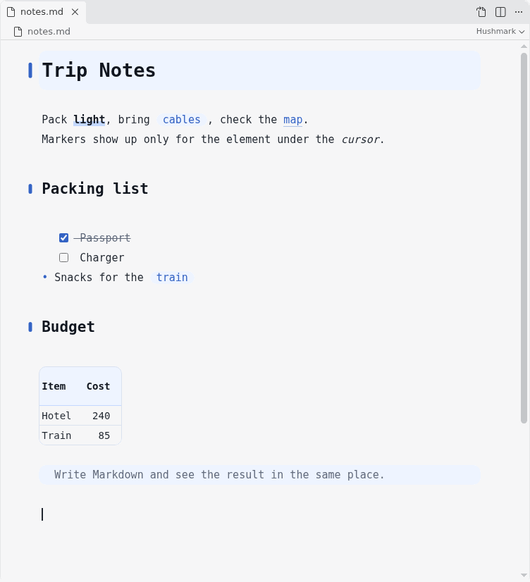

# Hushmark

[English](README.md)

カーソルが触れている要素だけ Markdown の記号を表示する、VSCode のライブプレビューエディタです。文書は Markdown のテキストのまま編集します。

見出しや引用などの行単位の記号は、カーソルのある行で表示します。`code`、*斜体*、リンクなどのインライン要素の記号は、カーソルがその要素に触れているときだけ表示します。それ以外の記号は隠し、見た目を整えて表示します。



## 特長

- 日本語の文でも強調が効きます。CommonMark の規則では、`**注意（readme.md 参照）。**の件` や `は**「重要」**です` のように、記号の内側が約物で外側が日本語の文字のときは強調になりません。Hushmark は [markdown-cjk-friendly](https://github.com/tats-u/markdown-cjk-friendly) と同じく、外側が日本語などの文字なら強調にします。内側が日本語の約物なら、外側が数字や英字でも強調にします（`**重要。**2つ目`）。`*` と `~~` も同じです。
- 見出し・引用・リスト・コードの記号は、表示しても隠しても文字の位置が変わりません。記号のあった幅を空けて残し、見出しの `#` は左の余白に表示します。強調やリンクの記号は、幅を残すと余分な空白に見えるので幅ごと隠します。そのため、カーソルがその要素に入ったときだけ、同じ行の後ろの文字が動きます。
- 字間と行間はソースのとおりです。等幅フォントの桁がそろうよう、要素ごとに文字の大きさや左右の余白を変えません。見出しだけは文字を大きくできますが、その場合も見出しの高さは本文の行の整数倍にします。
- 縦の位置はソースの行にそろえます。ブロックの上下に余白を足さず、ソースの空行や ` ``` ` の行をそのまま余白にします。表は、見出しの行を 2 行分（見出しと区切りの行）、データの行を 1 行分の高さで表示します。
- 背景や線の左端は 1 か所にそろえます。行頭に空白がない行は左端から少しだけ空いて、空白がある行は 1 文字分以上空いて始まるので、行頭の空白の有無が見て分かります。
- 見た目は、スタイル（線や背景、角の丸みなど）と色の組み合わせで選べます。各要素の色は、選んだ色を基準に自動で作り、文字は地の色に対して読みやすさの基準を満たします。
- 見出しの階層は、文字の大きさによらず、左の余白の図形で分かります。
- 文書を別の形式に変換しないので、保存しても書いた Markdown の書式（リストの記号、空白、改行コード）は変わりません。取り消し（Ctrl+Z）とやり直し（Ctrl+Y / Ctrl+Shift+Z）も使えます。
- ほかのエディタ（分割表示やテキストエディタ）での変更と、このエディタでの入力が重なっても、内容を壊しません。同じ場所を同時に変えたときは、このエディタで入力した文字を捨て、文書の内容に合わせて表示し直します。
- ほかのツールがファイルを書き換えると、表示に反映します。未保存の変更があるときは反映せずに通知し、通知の「Revert File」で未保存の変更を捨ててファイルの内容を読み込めます。
- 書き込めない文書（git の過去の版など）は編集できません。ファイルの属性による読み取り専用は、VSCode と同じく、設定 `files.readonlyFromPermissions` が有効なときだけ効きます。`files.readonlyInclude` と `files.readonlyExclude` にも従います。
- ウィンドウを再読み込みしたり VSCode を起動し直したりしても、カーソルとスクロールの位置を保ちます。
- 画面の文言は、VSCode の表示言語に合わせて英語か日本語で表示します。
- Web 版の VSCode（vscode.dev、github.dev）でも動きます。

## インストール

[Releases](https://github.com/vanpeiyu/hushmark/releases) から `hushmark-<version>.vsix` をダウンロードしてインストールします。ソースから .vsix を作る方法は [CONTRIBUTING.md](CONTRIBUTING.md) を参照してください。

- 手元の VSCode には、コマンドパレットの「Extensions: Install from VSIX...」で .vsix を選ぶか、次のコマンドでインストールします。

  ```sh
  code --install-extension hushmark-<version>.vsix
  ```

- Remote-SSH で使う場合、拡張はファイルがあるリモート側で動くので、接続先にもインストールします。Remote-SSH で開いたウィンドウで「Extensions: Install from VSIX...」を使うか、接続先で次のコマンドを実行します（`<commit>` は `ls ~/.vscode-server/cli/servers/` で確かめます）。

  ```sh
  ~/.vscode-server/cli/servers/Stable-<commit>/server/bin/code-server --install-extension hushmark-<version>.vsix
  ```

## 使い方

- エディタのタイトルバーの「ライブエディタで開く」か、エクスプローラーの右クリックメニューから開きます。
- テキストエディタに戻すときは、タイトルバーの「テキストエディタで開く」を使います。
- Markdown のファイルを常にこのエディタで開くときは、設定に次を書きます。

  ```json
  "workbench.editorAssociations": { "*.md": "hushmark.editor" }
  ```

## 表示と操作

| 要素 | カーソルが触れていないとき | 操作 |
|---|---|---|
| 見出し | `#` を隠す。スタイルに応じて、左の余白に階層を示す図形を出す。`##` だけの行は見出しにしない | ― |
| 強調・リンク | 記号を幅ごと隠す。`[foo]` のような参照リンクは、文書の中に `[foo]: URL` の定義があるときだけリンクにする（CommonMark と同じ） | Ctrl+クリック（macOS では Cmd+クリック）でリンクを開く。`#見出し` のリンクは、その見出しに移る（アンカーは GitHub と同じ規則で作る）。`other.md#見出し` は、開いた文書がこのエディタで開いたときに見出しに移る |
| 画像 | 文書の中には描画せず、ソースのまま薄く表示する（描画すると縦の位置がソースの行とそろわなくなるため） | マウスを載せると画像を浮かせて表示する。Ctrl+クリックで画像のファイルを開く |
| インラインコード | `` ` `` を隠し、その幅を背景の余白にする | ― |
| 行末の空白 2 つ（改行） | 空白の位置に薄い点を出す | ― |
| 箇条書き・タスク | `-` の位置に記号、`[ ]` の位置にチェックボックス | チェックボックスのクリックで `[ ]` と `[x]` を切り替える |
| 表 | 表の形で表示する | 下の「表の編集」を参照 |
| コードブロック | ` ``` ` を隠し、その行を上下の余白にする（言語名は行頭に出す）。言語ごとに色分けする | ― |
| 引用・水平線 | 記号を隠す | ― |
| フロントマター | 装飾しない | ― |

次の VSCode のエディタの設定（Markdown に対する値）に合わせます。Markdown にだけ適用するときは、`"[markdown]": { ... }` の中に書きます。変更はすぐに反映されます。

| 設定 | 動き |
|---|---|
| `editor.fontSize` | 文字の大きさ |
| `editor.lineHeight` | 行の高さ。`hushmark.lineHeight` が 1 未満のときに使う。`0`（既定）のときは、文字の大きさの 1.85 倍にする（日本語の文章に合わせ、VSCode の自動の 1.35 倍より広くする） |
| `editor.lineNumbers` | 行番号。`off` で消え、`interval` で 10 行ごとになる。`relative` は `on` と同じ表示になる。表には、表の行ごとにその行の番号を出す |
| `editor.wrappingIndent` | 折り返した行の字下げ。`none` 以外では、箇条書きや引用の 2 行目以降を本文の先頭の桁にそろえる |
| `editor.tabSize` | タブの幅 |
| `editor.wordWrap` | 折り返し。`off` のときは折り返さず、それ以外（`on`・`wordWrapColumn`・`bounded`）は画面の幅で折り返す。Alt+Z でその場で切り替えられる（設定は変えない） |
| `editor.renderLineHighlight` | カーソルのある行の背景。`line` と `all`（既定は `line`）で、行の左右の端まで薄い背景を付ける |
| `editor.renderLineHighlightOnlyWhenFocus` | `true` のとき、エディタにフォーカスがある間だけ行の背景を付ける |

キー操作は次のとおりで、VSCode のエディタと同じです。この README のほかの箇所では Windows と Linux のキーで書きます。macOS では、とくに断りがなければ Ctrl を Cmd に、Alt を Option に読み替えてください。

| キー | macOS | 動き |
|---|---|---|
| Ctrl+F / Ctrl+H | Cmd+F / Cmd+Option+F | エディタ内の検索 / 置換（下の「検索」を参照） |
| Ctrl+Shift+F / Ctrl+Shift+H | Cmd+Shift+F / Cmd+Shift+H | VSCode のフォルダー内の検索 / 置換。選択中の文字列を検索語にする |
| Ctrl+Shift+O | Cmd+Shift+O | 見出しの一覧を出し、選んだ見出しに移る（テキストエディタの「Go to Symbol in Editor」に当たる）。一覧で選んでいる間はその見出しを表示し、選ばずに閉じると元の位置に戻る |
| Ctrl+B | Cmd+B | 太字 |
| Ctrl+I | Cmd+I | 斜体 |
| Alt+Z | Option+Z | 折り返しの切り替え |
| 文字列を選んで URL を貼り付け | 同じ | 選んだ文字列を、その URL へのリンク（`[文字列](URL)`）にする（VSCode の Markdown のテキストエディタと同じ） |
| Ctrl+K の後のキー | Cmd+K の後のキー | VSCode の 2 つ打ちのキー（Ctrl+K Z など）として VSCode に渡し、文字としては入力しない |

表のセルを編集している間も、同じキーを使えます。

### 検索

VSCode のエディタの検索ウィジェットと同じく、右上に表示します。

| 操作 | macOS | 動き |
|---|---|---|
| Ctrl+F | Cmd+F | 開く。選択中の文字列（1 行以内）を検索語にする |
| 検索語を入力 | 同じ | 開いたときのカーソル位置から、最初の一致に移る |
| Enter / Shift+Enter、F3 / Shift+F3 | 左に加えて Cmd+G / Cmd+Shift+G | 次 / 前の一致 |
| Alt+C / Alt+W / Alt+R | Cmd+Option+C / W / R | 大文字と小文字の区別 / 単語単位 / 正規表現の切り替え |
| Ctrl+H、または左端の › | Cmd+Option+F、または左端の › | 置換の欄を出す。置換の欄で Enter は 1 件置換、Ctrl+Alt+Enter（macOS では Cmd+Option+Enter）はすべて置換 |
| Esc | 同じ | 閉じてエディタに戻る |

表の中の一致は、一致を含むセルに色を付けて示します。

フォルダー内の検索（Ctrl+Shift+F）の結果をダブルクリックや Enter で開くと、このエディタにフォーカスが入ります。ただし、一致した位置には移りません。VSCode がカスタムエディタに開く位置を渡さないためです。

### 表の編集

表は表の形で表示し、クリックしたセルだけを編集します。セルの中でも、太字やリンクの記号はカーソルが触れたときだけ表示し、長い内容はセルの幅で折り返します。列の幅は編集を始める直前の幅で固定し、セルから出ると計算し直します。

| 操作 | 動き |
|---|---|
| セルをクリック | そのセルの、クリックした位置から編集する |
| 表の上下の行で ↑ / ↓ | 表の端の行のセルを編集する |
| Tab / Shift+Tab | 次 / 前のセル。最後のセルで Tab を押すと行を追加する |
| Enter / Shift+Enter | 下 / 上のセル。表の端では表の外に出る |
| ↑ / ↓ | セルの中で折り返した行を移る。最初の行の ↑ / 最後の行の ↓ では、まずセルの先頭 / 末尾に移り、もう一度押すと上 / 下のセルに移る |
| Esc | 編集をやめて表の下の行に出る |
| `\|` を入力 | セルの区切りにならないよう、`\|` にエスケープする |

表にマウスを載せると、右上に次のボタンが出ます。

- 「＋行」「＋列」：行や列を追加する
- 「ソース」：表全体を Markdown のソースで表示する。カーソルが表から出ると元の表示に戻る。揃え位置（`:--:`）の変更や行・列の削除は、ここで行う

## 設定

見た目は、プレビューのスタイルと色の 2 つで選びます。どの組み合わせでも使えます。

| 設定 | 内容 |
|---|---|
| `hushmark.previewStyle` | プレビューのスタイル。`soft`（ソフト、既定）は丸い形と色の付いた線や面で親しみやすい見た目、`minimal`（ミニマル）は色と面をほとんど使わない見た目、`reference`（リファレンス）は見出しに「H1」などの札を付け、表やコードを枠で区切る見た目 |
| `hushmark.previewColor` | プレビューの色。`green`（グリーン）・`cyan`（シアン）・`blue`（ブルー）・`purple`（パープル）・`pink`（ピンク）・`orange`（オレンジ）・`sepia`（セピア）・`mono`（モノクロ、既定）・`custom`（カスタム） |
| `hushmark.previewColorScheme` | プレビューの明暗。`auto`（既定）は VSCode のテーマに合わせる。`light` と `dark` は、明るい地と暗い地に固定する |
| `hushmark.previewCustomColor` | `custom` のときの色（`#rrggbb`、既定 `#3366cc`）。この色の色相と鮮やかさを基準に、各要素の色を作る |
| `hushmark.colorCustomizations` | 要素の色を個別に変える（下の「色を個別に変えるとき」を参照） |
| `hushmark.headingSize` | 見出しの大きさ。`body`（等倍。すべて本文と同じ大きさ）・`medium`（中、既定。h1 と h2 を本文の 2 行分の高さにする）・`large`（大。h1 を 3 行分、h2 と h3 を 2 行分の高さにする） |
| `hushmark.fontFamily` | フォント（CSS の `font-family` の値）。空（既定）のときは VSCode のエディタのフォント（`editor.fontFamily`）を使う。例: `"HackGen Console NF", monospace` |
| `hushmark.lineHeight` | 文字の大きさに対する行の高さの倍率。1 未満（既定 `0`）のときは `editor.lineHeight` に従う |
| `hushmark.rightMargin` | エディタ右側にも、左と同じ幅の余白を空ける（既定 `true`） |
| `hushmark.debugLog` | デバッグログを出力パネル「Hushmark」に書き出す |

設定の変更はすぐに反映されます。

VSCode のハイコントラストのテーマを使っているときは、どの設定でも VSCode のテーマの色を使います。

### 色を個別に変えるとき

`hushmark.colorCustomizations` に、変えたい色を書きます。VSCode の `workbench.colorCustomizations` と同じく、`"[色の名前]"` の中に書いた色は、その色（`hushmark.previewColor`）を選んでいるときだけ使います。

```json
"hushmark.colorCustomizations": {
  "link": "#3366cc",
  "[sepia]": {
    "blockBackground": "#f0e6d2"
  }
}
```

変えられる色は次のとおりです。

| 名前 | 使うところ |
|---|---|
| `background` / `foreground` / `strongForeground` / `mutedForeground` | 背景、文字、見出しと太字の文字、記号と引用の文字 |
| `border` / `strongBorder` | 細い線と、少し濃い線（どこに使うかはスタイルによる） |
| `blockBackground` / `codeBackground` | コードブロックとフロントマターの背景、インラインコードの背景 |
| `accent` / `softAccent` / `accentBackground` | アクセント（チェックボックス、編集中のセル、`soft` の箇条書きの記号など）、淡いアクセント（`soft` の線）、アクセントの背景（`soft` の引用や表の見出し） |
| `link` | リンク |
| `highlight` | 太字の下の蛍光ペン（`soft`） |
| `selection` / `lineHighlight` | 選択範囲、カーソルのある行の背景 |

## アンインストール

インストールすると、次のものができます。

| もの | 場所 |
|---|---|
| インストールした拡張 | `~/.vscode/extensions/local.hushmark-<version>`（Remote-SSH の接続先では `~/.vscode-server/extensions/` の下） |
| 自分で書いた設定 | ユーザー設定の `workbench.editorAssociations` と `hushmark.*` |

次のコマンドを実行し、ユーザー設定に `workbench.editorAssociations` の `"*.md": "hushmark.editor"` や `hushmark.*` を書いていれば消します。

```sh
code --uninstall-extension local.hushmark
```

開発のために作るもの（テストに使う Docker のイメージなど）は、[CONTRIBUTING.md](CONTRIBUTING.md) を参照してください。

## 既知の制約

- 記号が隠れた行で、太字の末尾などの境目をクリックすると、カーソルは記号の外側に入ります。記号が表示されてからもう一度クリックすると、狙った位置に置けます。
- 見出しの上下に余白は足しません。空きが欲しいときは、ソースに空行を入れます。
- 画像は文書の中には描画しません（マウスを載せたときだけ表示します）。Mermaid と数式は描画せず、ソースのまま表示します。
- 取り消しの履歴は、このエディタの中だけのものです。分割表示した別の側や、テキストエディタで行った編集は、このエディタの Ctrl+Z では取り消せません。
- 表のセルの中では、`[foo]` のような参照リンクをリンクにせず、文字のまま表示します。表のセルの中の画像も描画しません。
- 表のセルで取り消すと、セルのカーソルは先頭に戻ります。
- ほかのエディタでの変更が離れた 2 か所にあると、その間にあるカーソルが動くことがあります。
- とても長い文書や大きな表では、入力やカーソルの移動が重くなることがあります。
- 結合文字や絵文字を含む行では、↑ / ↓ で移るときの桁が少しずれることがあります。

## ライセンス

MIT ライセンスです（`LICENSE` を参照）。

.vsix には CodeMirror などのパッケージを同梱しています。それぞれのライセンス文は、.vsix の中の `media/dist/THIRD_PARTY_LICENSES.txt` にあります（ビルドのときに作ります）。
